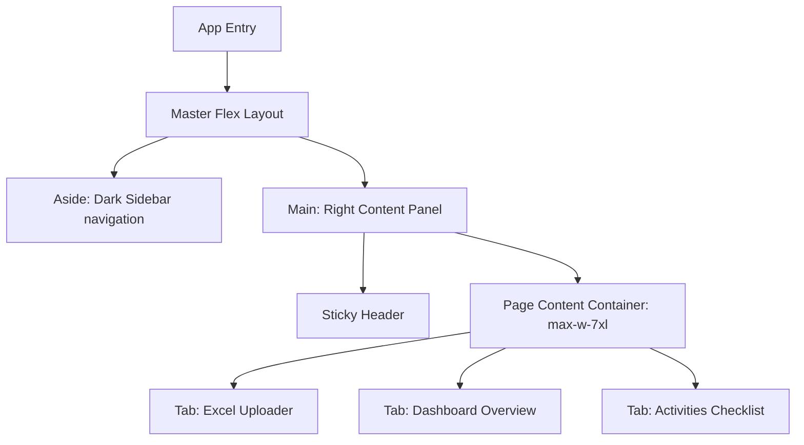

# UI/UX Design System Specification
## CHED IAS - WFP HEDF 2026 Monitoring System

This document outlines the UI/UX design architecture, components, guidelines, and interactive design patterns built into the **Work and Financial Plan (WFP) HEDF 2026 Monitoring System** for the **Commission on Higher Education - International Affairs Service (CHED IAS)**.

---

## 1. Design Philosophy

The application balances **government visual authority** with **modern, premium dashboard aesthetics**. Rather than utilizing static and flat traditional administrative styles, the layout integrates glassmorphism, fluid interactive animations, and responsive grids.

Key directives:
- **Authority & Trust:** Adheres to official color schemes (Philippine government blue, CHED gold).
- **Clarity & Focus:** Eliminates visual noise; uses high contrast and clear hierarchies to highlight financial values and track activity checklists.
- **Client-Side Privacy:** Emphasizes that all parsing and computations happen locally in the user's browser, building immediate system confidence.

---

## 2. Visual Identity & Color Palette

The theme extends standard color classes into tailored Tailwind configurations (`tailwind.config.js`):

```json
{
  "colors": {
    "gov": {
      "blue": {
        "DEFAULT": "#0038A8",
        "dark": "#002B80",
        "light": "#E6EEFF",
        "accent": "#0E59F2"
      },
      "gold": {
        "DEFAULT": "#FFC72C",
        "dark": "#D99B00",
        "light": "#FEF9E7"
      },
      "red": {
        "DEFAULT": "#D22630",
        "light": "#FCE8E9"
      }
    },
    "sidebar": "#0B192C",
    "dashboard": {
      "bg": "#F8FAFC",
      "border": "#E2E8F0"
    }
  }
}
```

### Color Mapping Guidelines

| Palette Element | Hex Code | System Application | Visual Rationale |
| :--- | :--- | :--- | :--- |
| **Primary Gov Blue** | `#0038A8` | Main action buttons, active navigation states, chart headers, total financial highlights. | Evokes government trust and administrative clarity. |
| **CHED Gold** | `#FFC72C` | Sub-branding tags, secondary accent indicators, highlight charts (maximum values). | Establishes the official institutional identity. |
| **Dark Slate** | `#0B192C` | Fixed navigation sidebar background. | Provides visual stability and a clear frame for dashboard content. |
| **Slate Background** | `#F8FAFC` | Dashboard canvas background. | Clean, low-fatigue slate grey context that makes cards pop. |
| **Gov Red** | `#D22630` | Danger items, alerts, close buttons, negative KPI cards. | High-importance notifications and warnings. |

---

## 3. Typography & Hierarchy

The interface utilizes **Google Font: Inter**, loaded via [index.html](file:///c:/Users/Localuser/Documents/ias-dashboard/index.html) to deliver high legibility for large tabular sheets and dense data points.

*   **Primary Font:** `font-sans: ['Inter', 'sans-serif']`

### Typography Scale

*   **System Title:** `text-lg font-bold` — Used in printable page headers.
*   **Header Titles:** `text-base font-extrabold text-slate-900` — Primary sticky top navigation headings.
*   **Component Headers:** `text-sm font-bold text-slate-800` — Modal titles, card groupings.
*   **Data Labels & Subtext:** `text-xs font-semibold uppercase tracking-wider text-slate-500` — KPI headers, filters, table headers.
*   **Numerical Metrics:** `text-2xl font-bold tracking-tight` — Main KPI statistics.
*   **Small Details:** `text-[10px]` — System alerts, footer copyright, detail metadata badges.

---

## 4. Glassmorphic Details & Cards

To break away from flat interfaces, the system uses a **Glassmorphism Design System** defined in [index.css](file:///c:/Users/Localuser/Documents/ias-dashboard/src/index.css):

```css
.glass-card {
  background: rgba(255, 255, 255, 0.85);
  backdrop-filter: blur(8px);
  -webkit-backdrop-filter: blur(8px);
  border: 1px solid rgba(226, 232, 240, 0.8);
}
```

### Component Structure: KPI Stat Card
Dynamic stat indicators combine light opacity backgrounds with border trims matching the card's color schema (`bg-gov-blue-light/50 border-gov-blue/20`):

```jsx
<div className={`glass-card p-6 rounded-2xl border transition-all duration-300 hover:shadow-md hover:-translate-y-0.5`}>
  {/* Content layout */}
</div>
```

---

## 5. Layout & Navigation Architecture

The interface uses a **2-Column Master Layout** which splits the layout into two primary areas:



### Sidebar Navigation (`w-64 bg-sidebar`)
- Consumes a constant 256px wide footprint.
- Built-in status block displaying current loaded WFP file metadata or warning empty states.
- Fully hidden during print rendering to prioritize paper space.

### Sticky Header (`sticky top-0 bg-white`)
- Contains navigation path titles, print outputs, download anchors, and link redirections.
- Retains page position during scroll states.

---

## 6. Components Breakdown

### A. Excel Uploader (`ExcelUploader.jsx`)
- **Drag-and-Drop Dropzone:** Dashed slate borders change to a thick solid government-blue scale on drag state transitions.
- **Instant Demo trigger:** Secondary shortcut buttons enable users to populate mock structures immediately, reducing initial setup friction.
- **Formatting Guidelines:** Clean bullet layout highlighting expected column mappings (Month, Project, Activity, Expenditure, Pax, Unit Cost, Budget, Remarks).

### B. Dashboard Overview Charts (`DashboardCharts.jsx`)
Visual assets rendered through **Recharts** leveraging the Gov color scheme:
1.  **Monthly Budget Trend (Area Chart):** Combines a thick blue path (`strokeWidth={2.5}`) with a light vertical color gradient fill to visualize month-on-month expenditure patterns.
2.  **Budget Distribution (Pie Chart):** Renders a hollow donut layout (`innerRadius={60} outerRadius={90}`) utilizing a legend with custom labels to prevent chart text overlaps.
3.  **Top 10 Activities (Horizontal Bar Chart):** Utilizes a horizontal layout for readability of long titles, emphasizing the highest-cost item in a distinct CHED gold bar color.

### C. Activity Checklist Table (`ActivityTable.jsx`)
- **Interactive Sorting Headers:** Dynamic sorting triggers displaying ascending/descending chevron overlays.
- **Multiphase Filter Panel:** Horizontal dashboard filters allowing instantaneous cross-column sorting.
- **Status Indicator Badges:** Items like Months and Program tags use color indicators to organize tabular sections.

---

## 7. Interactive Micro-Animations

- **Hover Translations:** KPI cards and checklist elements translate upward on active pointer focus (`hover:-translate-y-0.5 duration-300 hover:shadow-md`).
- **Interactive Modals:** Detail overlays enter the workspace with dynamic scaling indicators (`animate-in fade-in zoom-in-95 duration-200`).
- **Notification Overlays:** Confirmation notifications rise with spring-based entry animations, disappearing automatically after 4 seconds.

---

## 8. Print Optimization & PDF Reports

A customized media query stylesheet in [index.css](file:///c:/Users/Localuser/Documents/ias-dashboard/src/index.css) ensures printed physical documents render perfectly:

- **Invisible Elements (`display: none`):** Hides menus, buttons, filters, sticky top headings, sidebar navigation, and uploading controls.
- **Layout Expansion:** Expands right content elements to take up the full paper width (`100%`).
- **Shadow Removal:** Eliminates backdrop blurs and drop shadows, turning borders into solid, thin, print-friendly lines.
- **Grid Realignment:** Collapses multi-column card views into standard double-column rows (`print-grid-cols-2`).
- **Visual Page Breaks (`page-break-inside: avoid`):** Ensures tables, KPI cards, and charts do not clip in half across physical paper pages.
